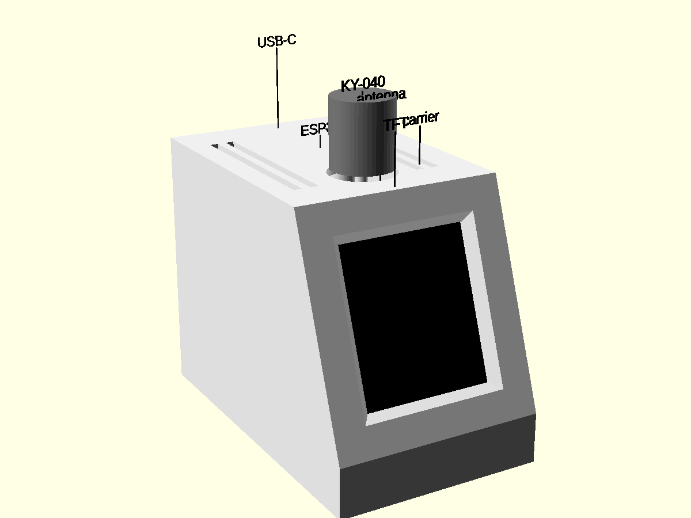
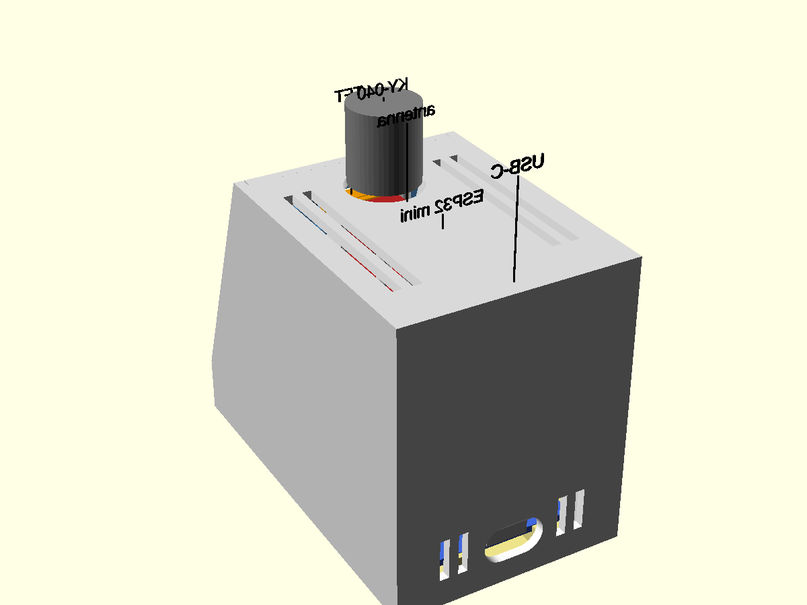
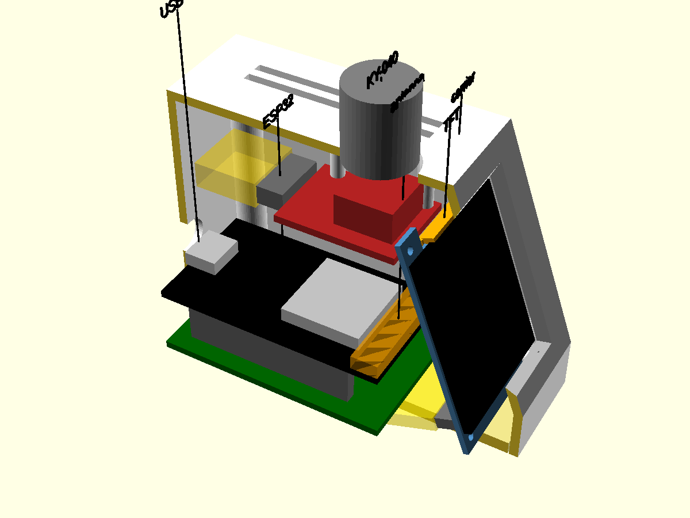
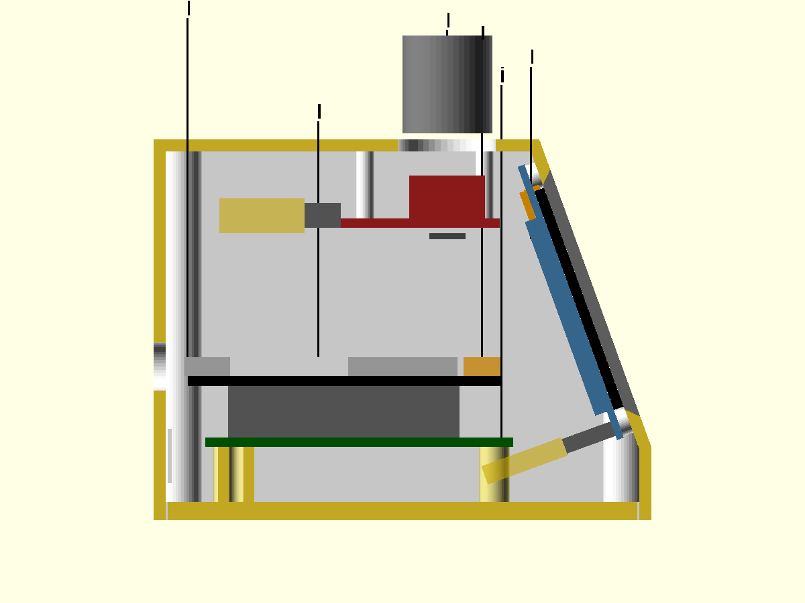

# Enclosure

OpenSCAD model of the case, lifted from the desk display's
(`../esp32-desk-display/enclosure/`) and written from
`MEASUREMENTS.md`. Open `enclosure.scad` in OpenSCAD for the assembled view
(modules shown as coloured stand-in blocks, see-through gold = plugged-in
connectors). `-D cut=25` cuts the printed parts away left of x = 25.

```
enclosure/export.sh   # clash check, then stl/enclosure/*.stl (gitignored) + renders/enclosure-*.png
```

The clash check fails if a printed part overlaps a module stand-in, or two
stand-ins (with their plugs) overlap each other.

 
 

## Cardboard mock-up

```
enclosure/cardboard.py [cardboard mm, default 2]   # -> enclosure/cardboard.pdf (gitignored)
```

Two A4 pages of 1:1 templates, sized from the model (`part="dims"`): 2
sides, front strip, screen panel (window + the TFT board's outline), top
(knob hole + the KY-040's outline), back (USB hole), and a floor with the
ESP32 mini drawn on it (an outline, not a hole). Print at
100% ("Actual size") and check the 50 mm bar with a ruler. Panels other
than the sides are narrower by 2 × the cardboard thickness, so they fit
between the sides. Checks: overall size on the desk, the screen's tilt and
readability, knob reach, and whether the window lines up with the real
TFT taped behind it.

## Layout (first draft, 2026-09-29)

50 x 82 x 62 mm (W x D x H). A small wedge: the TFT, portrait, on a front
panel tilted 20° back over a 12 mm strip; the knob on top, centred behind
the screen; USB-C out the back.

- **TFT**: glass flat against the panel's inner face, the board screwed from
  behind onto 4 posts at its corner holes, flattened on the glass side
  (0.3 mm clear of it). Pin header at the bottom, so the picture is
  upright with `FLIP_180 = 1` in `main/display.c`, as now. Its plug hangs
  down and back, ending ~12 mm in front of the ESP32.
- **Knob**: KY-040 flat under the top, shaft end to the front, pins to the
  back, pushed up into two snap hooks against 4 pads (as on the desk
  display). The cap goes on from outside afterwards.
- **ESP32 mini** (D1 mini layout, 31.51 x 39.02, no mounting holes): flat
  on the floor at the back, metal can up, USB end at the back wall, 3 mm
  above the floor (room for the solder joints). Held in a cradle on the
  base, no screws and nothing that flexes: the antenna end slides under
  two lips at the front corners, the back drops onto two rests with a
  stop behind them, side guides beside the pin rows, and a ledge on the
  shell's back wall sits 0.2 above the USB socket once the base is
  screwed on. Pin headers point up, on both inner rows and the outer row
  on the side away from the RST button; the TFT and knob cables plug onto
  them with female Dupont housings (tops ~24 mm above the floor, the
  knob's board is at 48). Kept at 82 deep for the cardboard mock-up
  already built; the USB hole is 16 mm lower than on that mock-up's back.
- **Antenna**: the ESP32's antenna end faces the front, in the middle of
  the case; nothing above it but the knob's board, 40 mm up.
- **Vents**: top slots left and right of the knob, over the ESP32; low slots
  on the back beside the USB; slots in the floor under the ESP32. No
  sensors, so no sensor bay: only the ESP32's warmth to let out.
- **Base**: floor plate held by 4 × M3 screws from below into the shell's
  corner bosses. The ESP32 is on the base and the TFT and knob are in the
  shell, so the cables need enough slack to lay the base beside the shell.

## Parts to print

| STL | Qty | Orientation (as exported) | Notes |
|---|---|---|---|
| `shell` | 1 | upside down, top on the bed | check the USB hole's 13 mm bridge |
| `base` | 1 | flat | the two lips over the front corners are 2.5 mm overhangs |
| `test_front` | 1 | like the shell | **print this first**: screen panel + top with the knob mount |

Material: PETG preferred (PLA softens ~55 °C). Fit clearance 0.3 mm (`clr`).

## Hardware

The M3 screws come from the user's self-tapping kit (M3-M6, round and flat
head; smallest M3 × 6). The screen's M2 screws come from a separate small
self-tapping kit (M2 × 4/5/6, M2.3, M2.6, M3 × 4-6, pan head).


- 4 × M3 × 10 self-tapping, round head (base → shell)
- 4 × M2 × 4 self-tapping, pan head (TFT → posts; a 6 would poke out the
  front). The TFT's holes measured 1.79: try one screw first, else drill
  them to 2.0
- 3 × 10-pin male headers on the ESP32 mini, pins up; cables to the TFT
  (8 wires) and knob (5 wires) with female Dupont housings on both ends;
  the TFT's VCC and the knob's + share the one 3V3 pin (two wires in one
  terminal)
- 4 self-adhesive rubber feet

## Test print checklist (`test_front`)

1. TFT: the glass sits flat on the panel, no pixels cut off at the window's
   edges (the window is the glass minus a 0.5 mm lip; the pixel area's
   position wasn't measured), the screws pull the board flat.
2. KY-040: it snaps in, the shaft is centred in the 16 mm hole, and the cap
   turns and presses without rubbing the top.

## Base print checklist

1. ESP32 mini: the antenna end slides under the two lips at a slight tilt
   and the back drops in front of the stops; no play left-right.
2. The soldered pins' stubs underneath don't touch the floor (3 mm room).
3. With the base screwed into the shell: the USB socket is centred in the
   hole, a cable plugs in fully, and the board's back end can't lift.

## Pictures and artifacts

`-D explode=55` lifts the shell (with the TFT and knob) off the base;
`-D mini_tilt=8 -D mini_back=6` shows the mini on its way into the cradle.
`artifacts/` holds the sources of the two claude.ai pages, since the pages
themselves are the only other copy:

- `artifacts/caliper.html`: "Mukklet Caliper Guide",
  https://claude.ai/artifact/QTPxyAx3xMNtYf33rQmrr3
- `artifacts/assembly/`: "Mukklet Assembly" (5 renders with labels drawn
  over them), https://claude.ai/artifact/TWDPQ22zmgzkANerb1wxgc. Renders:
  `openscad -D show_labels=false --colorscheme=Tomorrow --imgsize=1000,750`
  plus `-D explode=55 --camera=25,41,55,65,0,150,330` (a1),
  `-D show_shell=false -D explode=200 -D mini_tilt=8 -D mini_back=6
  --camera=25,58,8,60,0,140,150` (a2; a3 without the tilt),
  `--camera=25,41,34,65,0,150,290` (a5),
  `-D cut=25 --projection=o --camera=25,41,34,90,0,270,230` (a6).
