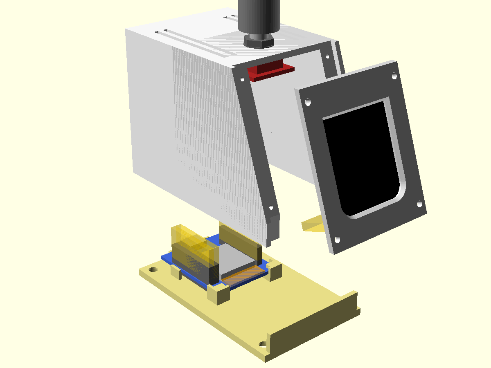

# Enclosure

OpenSCAD model of the case, lifted from the desk display's
(`../esp32-desk-display/enclosure/`) and written from
`MEASUREMENTS.md`. Open `enclosure.scad` in OpenSCAD for the assembled view
(modules shown as coloured stand-in blocks, see-through gold = plugged-in
connectors). `-D cut=25` cuts the printed parts away left of x = 25.

```
enclosure/export.sh   # clash check, then stl/enclosure/{body,front,base}.stl + optional/test_knob.stl (gitignored) + renders/enclosure-*.png
```

The clash check fails if a printed part overlaps a module stand-in, two
stand-ins (with their plugs) overlap each other, or two printed parts
overlap.

 
 


## Cardboard mock-up

```
enclosure/cardboard.py [cardboard mm, default 2]   # -> enclosure/cardboard.pdf (gitignored)
```

Two A4 pages of 1:1 templates, sized from the model (`part="dims"`): 2
sides, front strip, screen panel (window + the TFT board's outline), top
(knob hole + the KY-040's outline), back (USB hole), and a floor with the
ESP32 mini drawn on it (an outline, not a hole). Print at
100% ("Actual size") and check the 50 mm bar with a ruler. Panels other
than the sides are narrower by 2 × the cardboard thickness, so they fit
between the sides. Checks: overall size on the desk, the screen's tilt and
readability, knob reach, and whether the window lines up with the real
TFT taped behind it.

## Layout (three parts since 2026-10-02)

50 x 82 x 62 mm (W x D x H). A small wedge: the TFT, portrait, on a front
panel tilted 20° back over a 12 mm strip; the knob on top, centred behind
the screen; USB-C out the back.

Three printed parts: the **body** (side walls, top, back; open at the
bottom and the front), the **front plate** (the tilted screen panel, a
flat plate that drops in between the side walls) and the **base** (floor,
the strip under the screen, the ESP32's cradle). Why the plate is its own
part: in the one-piece shell a screwdriver couldn't reach the TFT's two
top screws (their line ran into the back wall, 34 mm up; from the open
bottom it was 24° off the screw). Now the TFT is screwed on while the
plate lies on the desk. It also means a wrong window costs one small
plate, not the whole case, and the plate prints face down.

- **Front plate**: lies on a rail along each side wall (6 wide, 8 deep,
  floor to top) and is held by 4 screws from the front, heads visible at
  its corners. Its bottom edge sits 0.2 above the base's strip.
- **TFT**: glass flat against the plate's inner face, the board screwed from
  behind onto 4 posts at its corner holes, flattened on the glass side
  (0.3 mm clear of it). Pin header at the bottom, so the picture is
  upright with `FLIP_180 = 1` in `main/display.c`, as now. Its plug hangs
  down and back, ending ~12 mm in front of the ESP32.
- **Knob** (v2): KY-040 flat under the top, shaft end to the front, pins
  to the back. Its threaded M7 collar goes up through a 7.3 hole and the
  nut that came with it, on its washer, clamps the encoder body against
  the inside of the top (2.2 of thread left above the nut). Two ribs
  beside the board's pin end stop it turning (1 mm clear of the board:
  the shaft's position across it is +-1). The cap goes on from outside
  afterwards, ~3 above the nut. Header straight down under the pin end,
  the plug ~6 above the ESP32's plugs. v1's snap hooks didn't hold.
- **ESP32 mini** (no mounting holes): flat
  on the floor at the back, metal can up, USB end at the back wall, 3 mm
  above the floor (room for the solder joints). Held in a cradle on the
  base, no screws and nothing that flexes: the antenna end slides under
  two lips at the front corners, the back drops onto two rests with a
  stop behind them, side guides beside the pin rows, and a ledge on the
  body's back wall sits 0.2 above the USB socket once the base is
  screwed on. Pin headers point up, on both inner rows and the outer row
  on the side away from the RST button; the TFT and knob cables plug onto
  them with female Dupont housings (tops ~24 mm above the floor, the
  knob's board is at 48). Kept at 82 deep for the cardboard mock-up
  already built; the USB hole is 16 mm lower than on that mock-up's back.
- **Antenna**: the ESP32's antenna end faces the front, in the middle of
  the case; nothing above it but the knob's board, 40 mm up.
- **Vents**: top slots left and right of the knob, over the ESP32; low slots
  on the back beside the USB; slots in the floor under the ESP32. No
  sensors, so no sensor bay: only the ESP32's warmth to let out.
- **Base**: floor plate over the whole 50 x 82 footprint, the body's
  walls standing on it (v2; in v1 it sat inside the walls and its screw
  holes ended up 0.2 from its edge), with the 12 mm strip under the
  screen standing on its front edge between the side walls (on the body
  it would be a 46 mm bridge when printed), held by 4 × M3 screws from
  below into the body's corner bosses. The
  ESP32 is on the base, the TFT on the plate and the knob in the body, so
  the cables need enough slack to lay the three beside each other.

Assembly order: TFT onto the plate (4 screws from behind), its cable on;
knob up through its hole from inside, washer and nut on from outside;
plate onto the body (4 screws from the front);
ESP32 into the cradle, cables on; base on (4 screws from below).

## Parts to print

| STL | Qty | Orientation (as exported) | Notes |
|---|---|---|---|
| `body` | 1 | upside down, top on the bed | check the USB hole's 13 mm bridge |
| `front` | 1 | screen face on the bed | the window's edge is chamfered: no supports |
| `base` | 1 | flat | the two lips over the front corners are 2.5 mm overhangs |
| `optional/test_knob` | 1 | like the body | optional: the top's front with the knob mount, to check it before the whole body |

Material: PETG preferred (PLA softens ~55 °C). Fit clearance 0.3 mm (`clr`).

## Hardware

Screws from the user's two self-tapping kits, silver stainless and small
black pan head. What's in them: their Homebox entries (`parts.py show screws`).

- 4 × M3 × 10, round head, silver kit (base → body; 4.0 holes in the
  base, pilot 2.5, 13 deep: the screw's tip reaches ~12.7)
- 4 × 2 × 6, black kit (front plate → rails; 2.4 hole in the plate,
  pilot 1.6, 6 deep: the screw reaches 4; v1's 2.3 × 8 snapped)
- 4 × 2 × 4, black kit (TFT → posts, pilot 1.6; a 6 would poke out the
  front). The TFT's holes measured 1.79: try one screw first, else drill
  them to 2.0
- 3 × 10-pin male headers on the ESP32 mini, pins up; cables to the TFT
  (8 wires, 12 cm) and knob (5 wires, 15 cm) with female Dupont housings
  on both ends: at the mini a 5-pin + a 3-pin + a 4-pin (which pad goes
  where: `docs/WIRING.md`); the TFT's VCC and the knob's + share the one
  3V3 pin (two wires in one terminal)
- 4 self-adhesive rubber feet

## Front plate checklist (`front`)

1. TFT: the glass sits flat on the plate, the screws pull the board flat.
   Flash with `EDGE_TEST 1` in `main/main.c`: the red outer frame shows on
   every side, with only a thin black strip (~0.2 top and bottom, ~0.5
   left and right) between it and the window's edge.
2. On the body: the plate drops in between the side walls (0.3 each side),
   lies flush with their edges, and its 4 holes meet the rails' pilots.

## Knob checklist (`test_knob` or `body`)

1. KY-040: the collar passes the 7.3 hole (else drill it to 7.5), the
   board sits between the two ribs, the nut tightens with thread to
   spare, and the cap turns and presses without touching the nut.

## Base print checklist

0. The strip under the screen stands 1.0 below the plate's bottom edge (v1: 0.2, and they touched) and
   flush with the side walls' front.
1. ESP32 mini: the antenna end slides under the two lips at a slight tilt
   and the back drops in front of the stops; no play left-right.
2. The soldered pins' stubs underneath don't touch the floor (3 mm room).
3. With the base screwed into the body: the USB socket is centred in the
   hole, a cable plugs in fully, and the board's back end can't lift.

## v2 (2026-10-10, not printed yet)

What changed after the first print (v1, its findings and files:
`archive/v1/`): the base covers the whole footprint (v1's screw holes
ended up 0.2 from its edge), base holes 4.0 and boss pilots 13 deep;
front plate screws 2 x 6 (v1's 2.3 x 8 snapped); the knob is held by its
own nut instead of snap hooks (one didn't catch); the window's top edge
3.4 lower and its bottom 1.05 higher, so the black glass round the
pixels (measured on v1 with the edge test screen: 3.6 top, 1.25 bottom)
mostly doesn't show; the window's bottom corners rounded r 5 like the
pixel area's (~42 px, found with the corner test screen, `EDGE_TEST 2`). The
base's strip under the screen 0.8 lower (1.0 under the plate): on v1,
with the plate screwed on, the base wouldn't go fully in at the front. The KY-040 in this
build had its header resoldered (2026-10-10): straight pins under the
board, pointing down; the stubs on top stay below the encoder body. Its
collar/nut sizes are in Homebox; the measuring page is
`pages/knob/knob.html`.

## Pictures and pages

`-D explode=45 -D explode_front=30` lifts the body off the base and pulls
the front plate (with the TFT) forward;
`-D mini_tilt=8 -D mini_back=6` shows the mini on its way into the cradle;
`show_body`, `show_front`, `show_base`, `show_tft`, `show_knob`,
`show_mini` hide single things.

`pages/` holds two local HTML pages (open the file in a browser; they
were claude.ai artifacts until 2026-10-02; the published copies are
deleted):

- `pages/caliper.html`: "Mukklet Caliper Guide", what to measure on the
  TFT and the ESP32 mini and how
- `pages/assembly/assembly.html`: "Mukklet Assembly", 8 renders with
  labels drawn over them, for the three-part case. `pages/assembly/render.sh`
  re-renders the pictures (cameras and flags are in it).

  The labels are SVG over each picture in a 1000 x 750 box: after a new
  render, check they still point at the right thing.
- `pages/knob/knob.html`: "Mukklet Knob Guide", the v2 knob mount (the
  KY-040's collar through a small hole in the top, held by its nut) and
  what was measured for it, with the user's numbers; `v2-knob.png` is
  from the model, cut through the knob.
